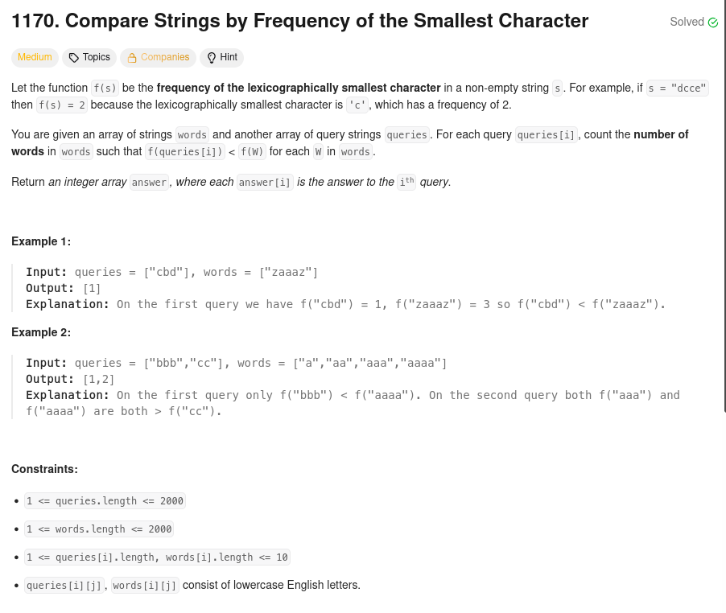
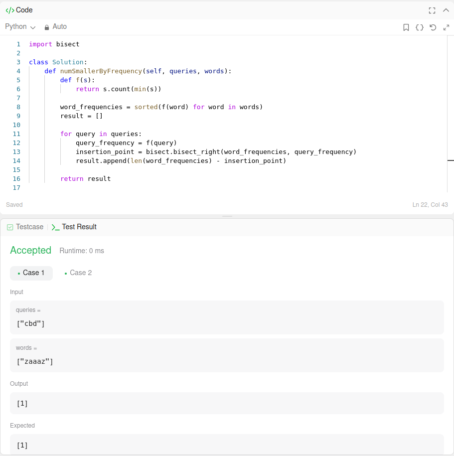

# A questão

É uma questão sobre comparar duas listas de strings (queries e words) a partir de uma função f(s), que retorna a frequência do menor caractere lexicográfico em uma string. O objetivo é, para cada query, contar quantas palavras em words possuem valor de f maior que o da query.

# Estratégia

Primeiro calculamos f(s) para todas as palavras em words e fizemos a ordenação desse vetor de frequências. A partir disso, para cada query foi necessário calcular f(query) e descobrir quantos valores em words são maiores.

A ordenação permite que seja usada a busca binária, reduzindo a complexidade. Assim, em vez de comparar cada query com todas as words (o que seria busca sequencial e custaria mais caro), encontra-se em tempo logarítmico o ponto onde as frequências de words começam a ser maiores que a de query.

# Algoritmo utilizado

O algoritmo usado foi o de busca binária. A aplicação dela aparece na etapa de encontrar a primeira posição em que a frequência de words é maior que a frequência de query. Isso é feito com a função bisect_right, que implementa exatamente a lógica da busca binária em listas ordenadas.

Essa escolha torna o algoritmo mais eficiente do que a busca sequencial, aproveitando a estrutura ordenada e reduzindo o custo de cada consulta.

- **Tempo**: O(n log n + m log n)
  - O(n log n): Ordenação do array de frequências das palavras
  - O(m log n): Para cada query (m), busca binária (log n)
  - Onde n = número de palavras, m = número de queries

- **Espaço**: O(n)
  - Array ordenado com as frequências das palavras

# Resultado

A solução passou nos testes, conforme atesta a imagem a seguir.

