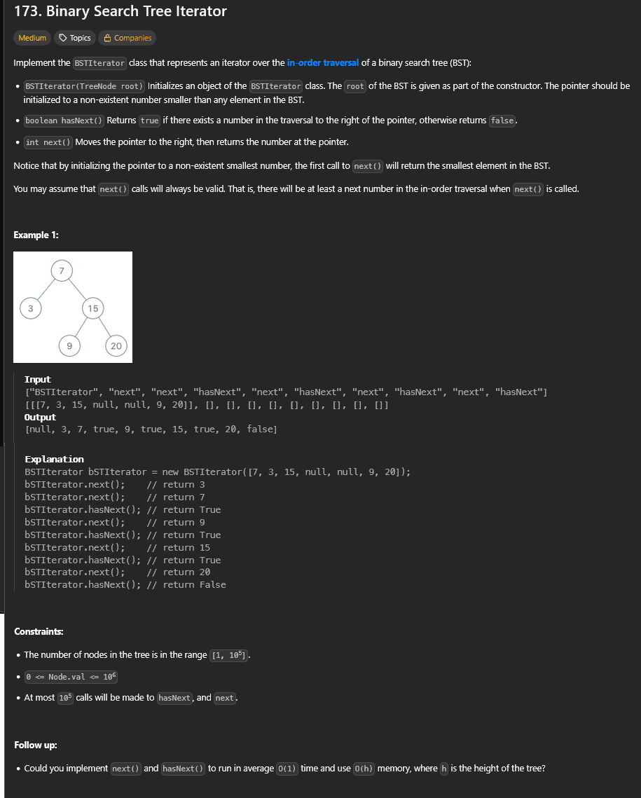

# A questão

É um desafio que pede para implementar um **iterador** sobre uma **árvore binária de busca (BST)**.  
A ideia é criar uma classe `BSTIterator` com dois métodos principais:  
- `next()`: retorna o próximo menor número da BST;  
- `hasNext()`: retorna se ainda existem elementos para visitar.  

O iterador deve seguir a ordem **in-order** (esquerda → nó → direita), que em uma BST gera os valores em **ordem crescente**.

---

# Estratégia

A solução usa uma **pilha** para simular o percurso in-order.  
- Na inicialização, empilho todos os nós da **coluna da esquerda** (até o menor valor).  
- O método `next()` retira o topo da pilha (o próximo nó em ordem).  
   - Se esse nó tiver subárvore direita, empilho novamente toda a sua coluna da esquerda.  
- O método `hasNext()` verifica apenas se a pilha ainda tem elementos.

Essa abordagem garante que cada nó seja visitado uma única vez, sem precisar armazenar todo o percurso de antemão.

---

# Algoritmo utilizado

- **Estrutura de dados:** pilha para armazenar os nós à esquerda.  
- **Métodos:**
  - `_push_all_left(node)`: empilha todos os nós à esquerda de `node`.  
  - `next()`: desempilha um nó, processa, e se tiver filho à direita empilha novamente sua coluna da esquerda.  
  - `hasNext()`: retorna se a pilha não está vazia.  

---

# Resultado

A solução funciona para percorrer a árvore em ordem crescente, retornando os valores de forma eficiente com `next()` e `hasNext()`.

