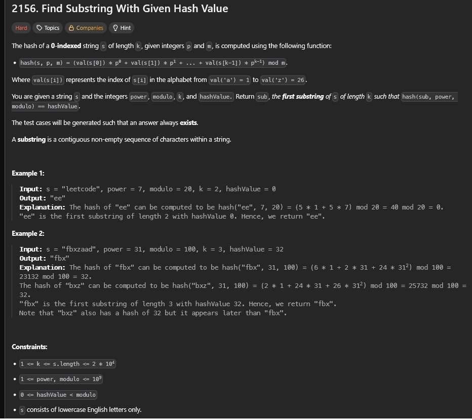
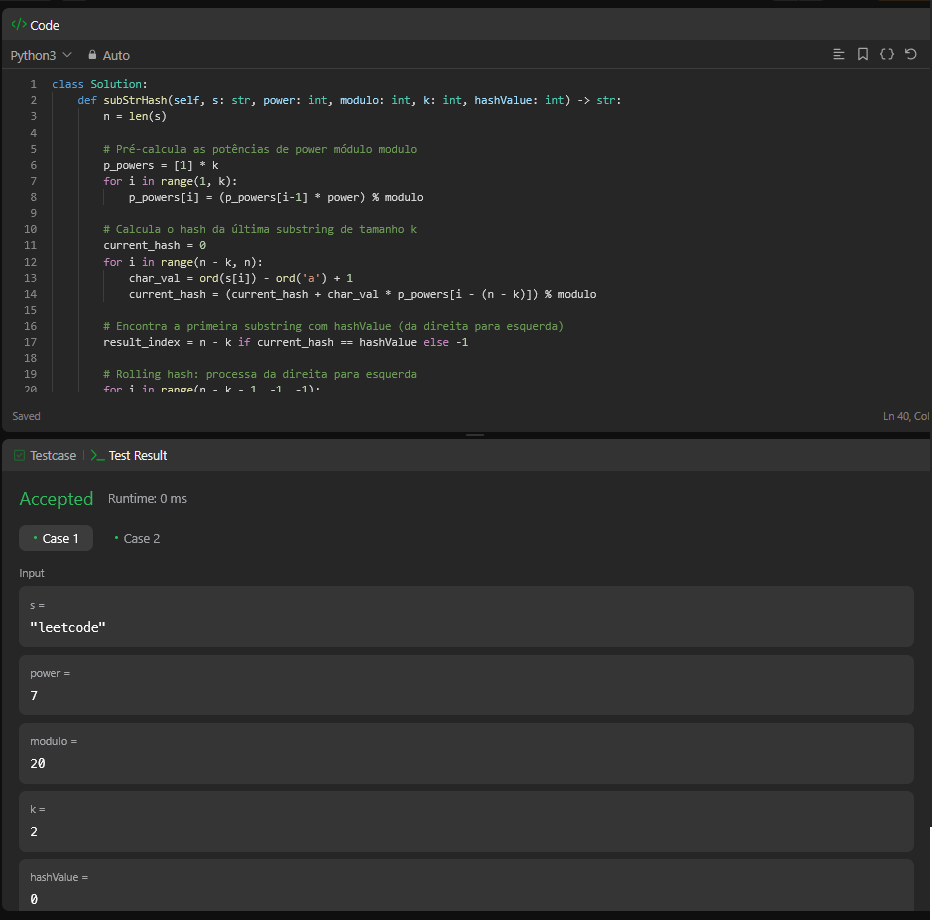

# A questão

É um desafio que pede para encontrar a **primeira substring** de tamanho `k` em `s` cujo **hash polinomial** (base `power`, módulo `modulo`) seja exatamente `hashValue`.  
O hash é a soma de `val(s[i]) * power^i` para `i = 0` até `k - 1`, tudo módulo `modulo`, onde `val('a') = 1` até `val('z') = 26`.

# Estratégia

Uso **rolling hash** (hash polinomial com janela deslizante):  
-  Calculo o **hash da última janela** `s[n-k:n]`.  
- Deslizo a janela **da direita para a esquerda**:
   - removo o caractere que sai à direita (peso `power^(k-1)`),
   - **multiplico por `power`** para ajustar os pesos,
   - somo o novo caractere que entra à esquerda (peso `power^0`).  
- Quando o hash bate `hashValue`, **guardo o índice**. Como vou da direita para a esquerda, fico com a **primeira** substring correta.

# Algoritmo utilizado

- **Potências pré-calculadas** para os pesos `power^0` até `power^(k-1)` (módulo `modulo`);
- **Hash inicial** da janela final;
- **Atualização em O(1)** a cada passo ao mover a janela.

**Complexidade:** **tempo linear** no tamanho de `s`.  
**Memória:** `O(k)` para as potências (pode ser `O(1)` guardando só `power^(k-1)`).

# Resultado

A solução passou nos testes, encontrando a **primeira** substring de tamanho `k` com hash igual a `hashValue`.

