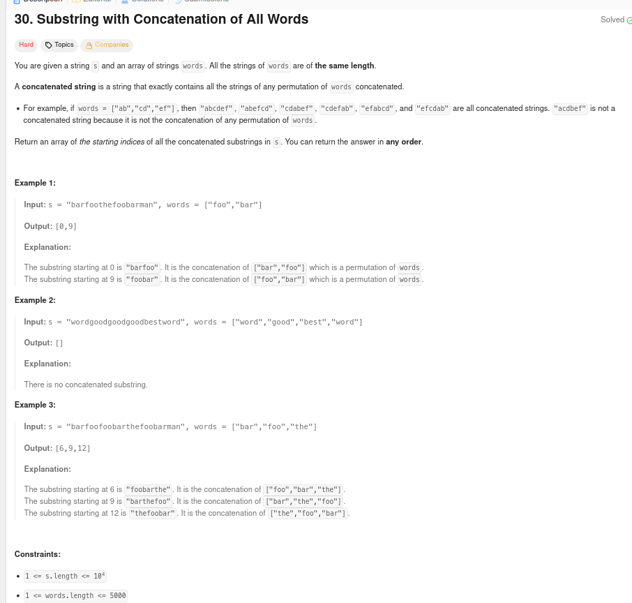
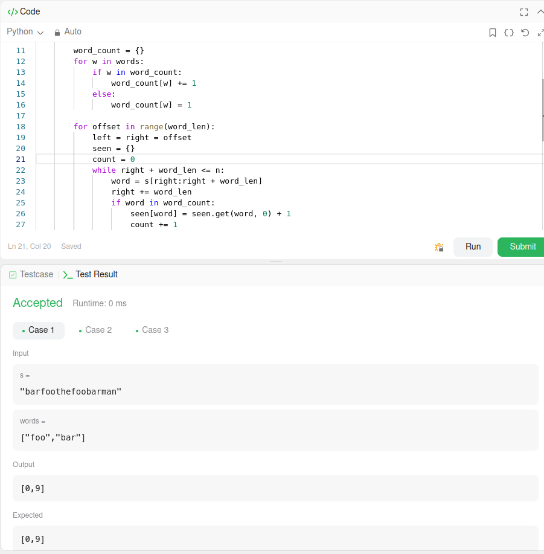

# A questão

É uma questão sobre encontrar todas as posições na string em que ocorre a concatenação exata de todas as palavras fornecidas na lista words, em qualquer ordem.

# Estratégia

A estratégia é tratar o problema como uma busca em blocos de tamanho fixo dentro da string s. Para verificar rapidamente se cada bloco é uma palavra válida de words, utilizamos hashing. Em vez de comparar sequencialmente cada palavra, usamos dicionários para localizar e controlar a frequência de cada ocorrência.

Combinamos isso com a técnica de janela deslizante, que permite reaproveitar a busca sem reiniciar do zero a cada posição, ajustando apenas quando uma palavra inválida aparece ou quando há excesso de uma palavra.

# Algoritmo utilizado

O algoritmo de busca utilizado foi o de hashing.

- Primeiro fizemos um dicionário word_count que armazena a frequência de cada palavra de words.
- Depois percorremos a string s em passos do tamanho de cada palavra (word_len), controlando uma janela com os ponteiros "left" and "right".
- Para cada palavra da janela, consultamos o dicionário em O(1) para verificar se ela pertence ao conjunto e se ainda pode ser usada.
- Se a frequência ultrapassar o permitido, a janela é movida para frente até corrigir.

Quando o número de palavras válidas na janela for igual ao tamanho da lista words, encontramos uma concatenação e a posição inicial é salva.

- **Tempo**: O(n + m)
  - O(m): Construção do dicionário de palavras
  - O(n): Percurso da string com a janela deslizante
  - Onde n = tamanho da string s, m = número de palavras

- **Espaço**: O(m)
  - Dicionário word_count para armazenar frequências das palavras

# Resultado

A solução passou nos testes, conforme atesta a imagem a seguir.

