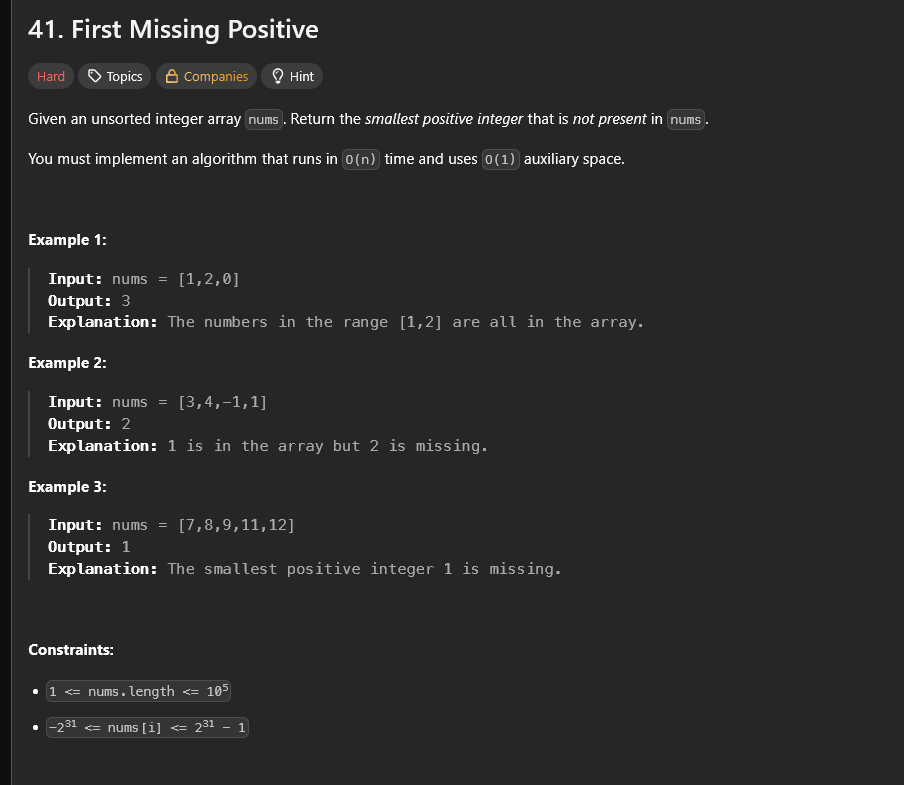
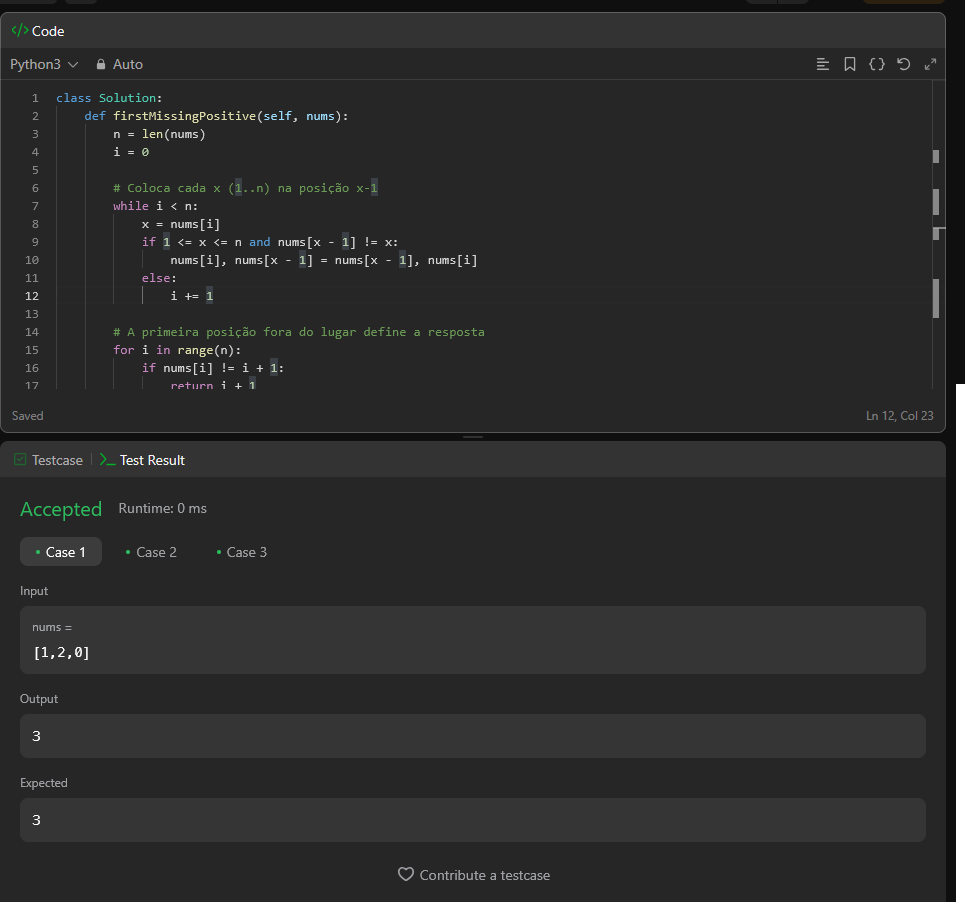

# A questão

É um desafio que pede o menor número inteiro positivo ausente em um array não ordenado.
A ideia é reorganizar o array de forma que cada número x (se estiver no intervalo válido) fique na posição x-1. No final, o primeiro índice em que nums[i] != i+1 indica o resultado. Se todos estiverem corretos, o número ausente é n+1.

# Estratégia

A solução foi achar o menor número positivo que não está no array.  
O detalhe, é que o algoritmo tem que rodar em O(n) e não pode usar espaço extra além do próprio array.

Assim, se o array tem tamanho `n`, a resposta está no intervalo de `1` até `n+1`.  
Ou seja, não importa se aparecerem números negativos ou muito grandes, eles não influenciam na resposta.

O que eu fiz foi tentar colocar cada número no “seu lugar certo”:  
- o número `1` deveria estar na posição `0`,  
- o número `2` na posição `1`,  
- e assim por diante.  

Enquanto percorro o array, se vejo um valor que deveria estar em outro índice, faço a troca.  
No final, passo de novo e procuro o primeiro índice `i` em que `nums[i] != i+1`. Esse `i+1` é a resposta.  
Se não encontrar, quer dizer que o array tinha todos os números de `1` a `n`, então a resposta é `n+1`.

# Algoritmo utilizado

É uma espécie de **ciclo de reposicionamento** dentro do próprio array.  
Cada número é trocado até estar no índice correto, e como cada valor só pode ser trocado algumas vezes, a complexidade continua O(n).

# Resultado

A solução passou nos testes, conforme atesta a imagem a seguir.

