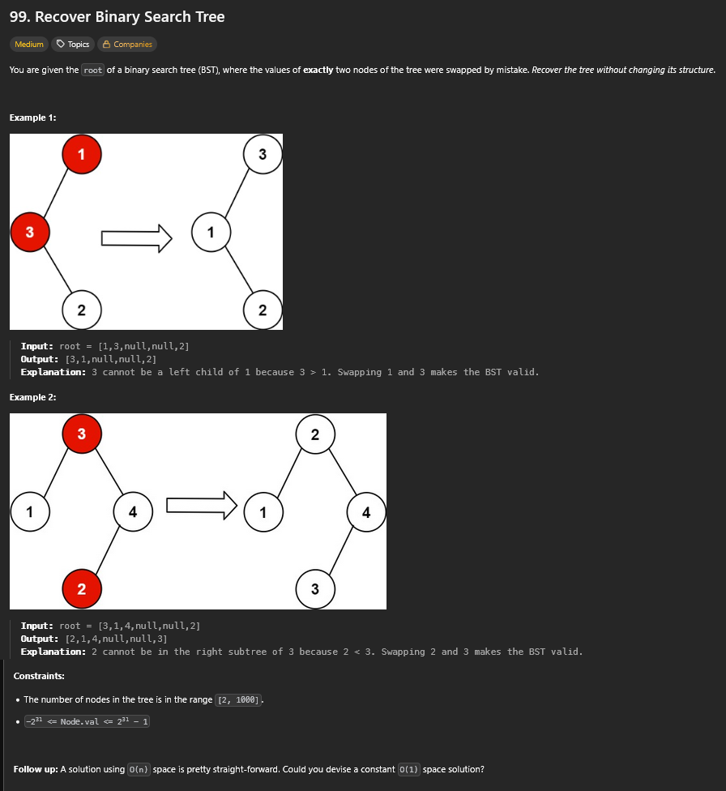
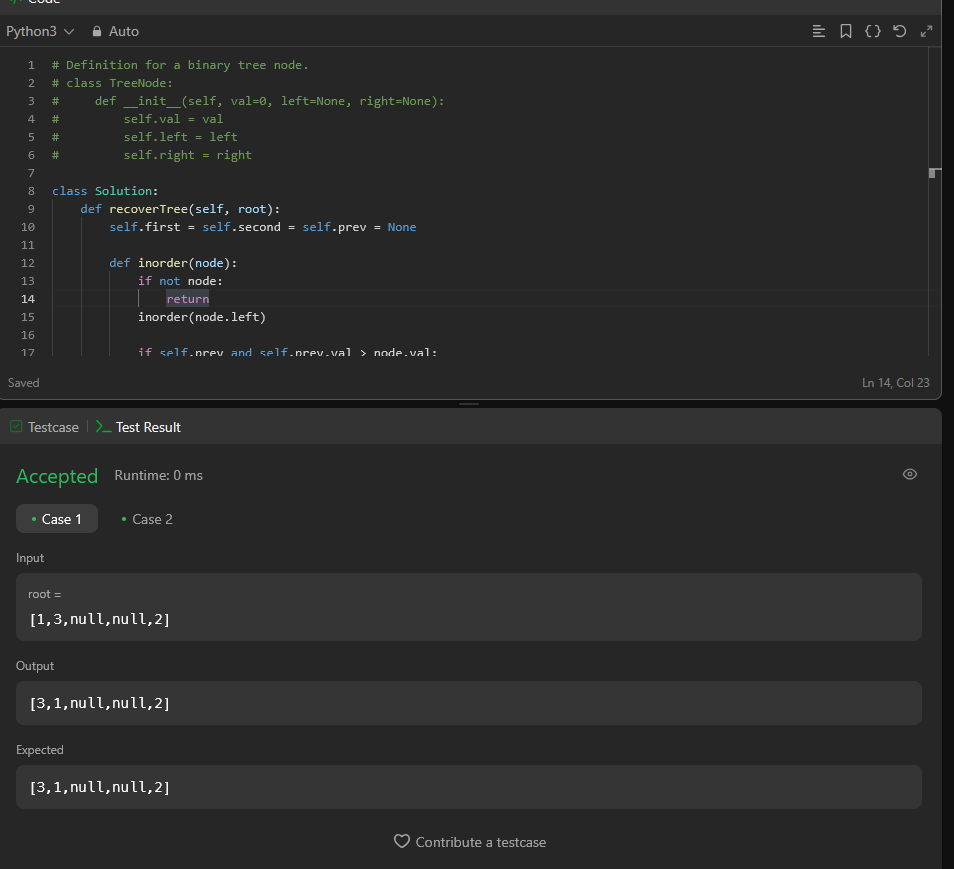

# A questão

# Estratégia

Nesse problema temos uma árvore de busca binária (BST), mas dois nós tiveram seus valores trocados por engano.  
A tarefa é “consertar” a árvore, sem mudar sua estrutura.

O que ajuda aqui é lembrar que uma travessia **inorder** de uma BST sempre gera uma sequência crescente.  
Se algo deu errado, essa sequência vai ter quebras na ordem.  
No caso de dois nós trocados, aparecem exatamente duas quebras:

- O primeiro ponto em que um valor é maior do que o próximo.  
- O segundo ponto em que um valor é menor do que o anterior.  

Esses dois nós são os que foram trocados. Depois basta inverter os valores deles para recuperar a árvore.

# Algoritmo utilizado

Fiz uma travessia inorder (recursiva, que é mais simples de escrever) e fui guardando o nó anterior.  
Quando achei uma inversão, marquei o primeiro nó e o segundo.  
No fim, troquei os valores entre eles e pronto.

Existe também uma versão mais avançada com **Morris Traversal**, que usa O(1) espaço extra.  
Mas a solução recursiva já é suficiente para passar em todos os testes.

# Resultado

A solução passou nos testes, conforme atesta a imagem a seguir.

